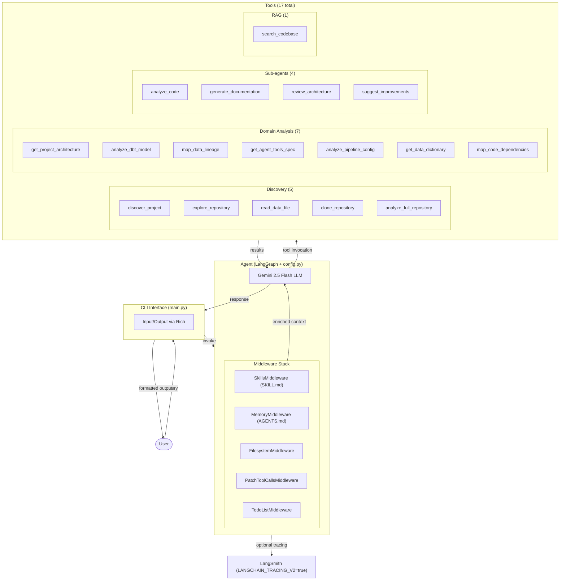

# Lupus — AI Code Intelligence Agent

Agente conversacional para análise de repositórios via interface de chat. O Lupus consulta os arquivos reais do projeto através de 17 ferramentas especializadas. Todas as respostas são fundamentadas no código-fonte analisado, sem extrapolações baseadas em conhecimento geral.

## Configuração

Especifique qual repositório analisar através de:
- **`.env`**: configure `PROJECT_PATH` com o caminho absoluto do repositório local
- **Chat interativo**: forneça uma URL do GitHub e o agente realizará clone automático sem necessidade de restart
- **Padrão**: se não configurado, analisa o projeto SRAG incluído no repositório

Implementado com [DeepAgents](https://github.com/deepagents) (LangChain + LangGraph) e Gemini 2.5 Flash.

## Capacidades

O agente fornece análise técnica de repositórios através de 17 ferramentas organizadas em 4 categorias:

### Ferramentas de Discovery (5)

Mapeamento automático e exploração inicial do repositório:
- `discover_project`: detecção de stack tecnológico (dbt, Node.js, Go, Java, Terraform, Kubernetes, Docker, Jupyter notebooks)
- `explore_repository`: enumeração de estrutura de arquivos com análise de padrões de segurança
- `read_data_file`: análise de dados estruturados (CSV, JSON, Parquet, Excel)
- `clone_repository`: clonagem de repositórios GitHub públicos com atualização automática do contexto
- `analyze_full_repository`: pipeline integrado de clonagem, exploração e análise

### Ferramentas de Análise de Domínio (7)

Análise estruturada de componentes específicos através da leitura de arquivos reais:
- `get_project_architecture`: análise de arquitetura (Medallion Architecture, modularização, fluxo de dados)
- `analyze_dbt_model`: análise de modelos dbt (camadas Bronze/Silver/Gold, transformações SQL, testes)
- `map_data_lineage`: rastreamento de linhagem de dados (origem até camadas finais)
- `analyze_pipeline_config`: análise de pipelines (DABs, schedule, deploy, orquestração)
- `get_data_dictionary`: extração de schema (colunas, tipos de dados, descrições por camada)
- `map_code_dependencies`: análise de grafo de dependências (imports Python/JS/TS/Go, bibliotecas externas)
- `get_agent_tools_spec`: especificação de agentes (tools, guardrails, integrações)

### Sub-agentes para Síntese (4)

Análise de nível superior através de invocação interna do LLM:
- `analyze_code`: leitura e explicação de arquivo específico
- `generate_documentation`: geração de documentação em formato Markdown
- `review_architecture`: análise crítica de decisões arquiteturais
- `suggest_improvements`: recomendações baseadas em análise do repositório

### Busca Semântica (1)

- `search_codebase`: busca híbrida no código-fonte (FAISS para busca vetorial + BM25 para busca por palavra-chave + RRF para fusão de rankings + CrossEncoder para reranking)

## Geração de Documentação

A ferramenta `generate_documentation` produz documentação em formato Markdown a partir da análise do repositório. Exemplos de uso:

```
"Gera documentação completa da arquitetura"
"Cria diagrama em Markdown da linhagem de dados"
"Documenta as transformações principais do dbt"
```

A documentação gerada é salva automaticamente no diretório do projeto analisado.

---

## Arquitetura

### Fluxo de uma pergunta



---

### Pipeline RAG — como `search_codebase` funciona internamente


---

### Quando o agente escolhe cada tool

| Pergunta do usuário | Tool acionada |
|---|---|
| "Quais tecnologias esse projeto usa?" | `discover_project` |
| "Me mostra a estrutura de arquivos do projeto" | `explore_repository` |
| "Tem algum CSV aqui? Me mostra as colunas" | `read_data_file` |
| "Analisa o repositório github.com/dbt-labs/jaffle_shop" | `analyze_full_repository` |
| "Qual a arquitetura do projeto?" | `get_project_architecture` |
| "O que faz o silver_srag_data.sql?" | `analyze_dbt_model` |
| "Como os dados fluem do Bronze ao Gold?" | `map_data_lineage` |
| "Qual o schedule do pipeline?" | `analyze_pipeline_config` |
| "Quais colunas tem na Gold?" | `get_data_dictionary` |
| "Como o ai_agent usa o LLM?" | `get_agent_tools_spec` |
| "Quais módulos esse projeto importa mais?" | `map_code_dependencies` |
| "Leia o arquivo X para mim" | `analyze_code` |
| "Gere documentação da arquitetura" | `generate_documentation` |
| "Por que usaram ephemeral na Bronze?" | `review_architecture` |
| "Quais melhorias você sugere pro projeto?" | `suggest_improvements` |
| "Como `obito_srag_flag` é criada no SQL?" | `search_codebase` |

## Technology Stack

| Component | Technology | Rationale |
|-----------|-----------|-----------|
| Agent Framework | DeepAgents (LangChain + LangGraph) | Stateful conversation memory with pluggable middleware |
| LLM | Gemini 2.5 Flash | Low latency, cost-effective, strong tool-calling capability |
| Semantic Search | FAISS (local) + BM25 + RRF + CrossEncoder | Hybrid search pipeline, no external API, data remains local |
| CLI Framework | Rich | Structured output formatting (markdown, panels, progress indicators) |
| Persona System | SKILL.md + SkillsMiddleware | Context-aware instructions, consistent behavior |
| Conversation Persistence | SQLite | Multi-turn session memory with checkpoint support |
| Observability | LangSmith (optional) | Automatic tracing, tool invocation logging |
| Reference Project | SRAG | Real-world data pipeline (Databricks + dbt + LLM agent) |

### Design Decisions

- **Local semantic search**: FAISS operates offline without external APIs. Sensitive repository data does not leave the user's machine.
- **Real-time context**: Tools read actual files from the project; no reliance on training data cutoff dates.
- **Modular architecture**: Each tool is independently deployable and testable.
- **Self-documenting**: The agent generates documentation describing the analyzed repository.

## Project Structure

```
lupus/
├── Entry Points
│   ├── main.py                    # CLI interface
│   ├── config.py                  # Central configuration (LLM, tools, middleware)
│   └── .env.example               # Environment template
│
├── Core Agent
│   ├── core/
│   │   ├── context_manager.py     # Repository context state and hook management
│   │   └── repo_context.py        # Repository metadata (path, cache version, RAG sync)
│   └── skills/lupus/SKILL.md      # Persona definition and behavior constraints
│
├── Tools (17 total)
│   ├── tools/__init__.py          # Tool registry and exports
│   │
│   ├── Discovery Tools (5)
│   │   ├── project_discovery.py   # Stack detection
│   │   ├── repository_explorer.py # File structure enumeration
│   │   ├── data_file_reader.py    # Structured data parsing
│   │   ├── github_integration.py  # Repository cloning
│   │   └── full_analysis.py       # Combined discovery pipeline
│   │
│   ├── Domain Tools (7)
│   │   ├── architecture.py        # Architecture analysis
│   │   ├── dbt_analyzer.py        # dbt model analysis
│   │   ├── lineage.py             # Data lineage tracing
│   │   ├── pipeline_analyzer.py   # Pipeline configuration analysis
│   │   ├── data_dictionary.py     # Schema extraction
│   │   ├── code_dependencies.py   # Dependency graph analysis
│   │   └── agent_analyzer.py      # Agent specification
│   │
│   ├── Sub-agents (4)
│   │   └── subagents.py           # analyze_code, generate_documentation, review, suggest
│   │
│   ├── RAG Tools (1)
│   │   └── rag_search.py          # Semantic search
│   │
│   └── Utilities
│       ├── cache.py               # LRU cache with TTL
│       └── path_helpers.py        # Path resolution utilities
│
├── RAG Module
│   ├── rag/
│   │   ├── indexer.py             # Semantic chunking + FAISS index builder
│   │   ├── retriever.py           # Hybrid search + CrossEncoder reranking
│   │   └── index/                 # Generated indices (gitignored)
│
├── Testing & Evaluation
│   ├── tests/                     # Integration tests
│   ├── evaluation/
│   │   ├── dataset.json           # Test dataset (25 questions)
│   │   └── run_evaluation.py      # Evaluation harness with LLM judge
│   └── scripts/
│       ├── build_rag_index.py     # RAG index builder
│       └── generate_docs.py       # Documentation generator
│
├── Documentation
│   ├── docs/                      # Development documentation
│   ├── README.md
│   └── AGENTS.md                  # Agent context and guidelines
│
└── Reference Project
    └── srag_agent/                # Sample project (Databricks + dbt + LLM)
```

### Data Flow

```
Input Query (main.py)
         ↓
    config.make_agent() → LangGraph Executor
         ↓
    Middleware Stack (Skills, Memory, Filesystem)
         ↓
    Gemini 2.5 Flash (LLM reasoning + tool selection)
         ↓
    Tool Invocation (discovery, domain, RAG, sub-agents)
         ↓
    File I/O + Semantic Search (RAG pipeline)
         ↓
    LLM Response Synthesis
         ↓
    Rich CLI Output Formatting
         ↓
    User Output
```

## Setup

```bash
# 1. Clone repository
git clone https://github.com/seu-usuario/lupus.git
cd lupus

# 2. Create virtual environment
python -m venv venv
source venv/bin/activate  # Linux/macOS
# ou: venv\Scripts\activate  # Windows

# 3. Install dependencies
pip install -r requirements.txt

# 4. Configure environment
cp .env.example .env
# REQUIRED: Set GOOGLE_API_KEY from https://aistudio.google.com/app/apikey
# OPTIONAL: Set PROJECT_PATH to specify target repository

# 5. Build RAG index (first time only, ~2 minutes)
python scripts/build_rag_index.py

# 6. Start agent
python main.py
```

### Verificação de Setup

Após iniciar, o agente deve estar pronto para receber consultas. Exemplos de primeira entrada:

```
"What is the project architecture?"
"Identify technologies used"
"Analyze https://github.com/dbt-labs/jaffle_shop"
```

---

## Configuração de Repositório

O agente pode ser direcionado para analisar diferentes repositórios através de três mecanismos:

### Método 1: Configuração estática via `.env`

Configure a variável `PROJECT_PATH` no arquivo `.env` com o caminho absoluto do repositório:

```env
# .env
GOOGLE_API_KEY=sua-chave-aqui
PROJECT_PATH=/Users/seu-usuario/Documentos/meu-projeto-python
# ou no Windows:
# PROJECT_PATH=C:\Users\seu-usuario\Documents\meu-projeto-python
```

Após editar `.env`, reinicie o agente:
```bash
python main.py
```

Todas as ferramentas operarão sobre o repositório especificado até uma nova configuração.

### Método 2: Clone dinâmico via interface de chat

Durante a execução, o usuário pode fornecer uma URL de repositório GitHub. A ferramenta `clone_repository` realiza o clone e atualiza automaticamente o contexto de análise sem necessidade de restart:

```
Input: "Analyze repository https://github.com/dbt-labs/jaffle_shop"

Output: Repository cloned successfully. PROJECT_PATH updated. 
        All tools now operate on jaffle_shop.
```

Exemplos de repositórios para teste:
- `https://github.com/dbt-labs/jaffle_shop` (dbt reference project)
- `https://github.com/apache/airflow` (orchestration framework)

### Método 3: Troca de contexto durante sessão

Forneça uma URL diferente para mudar o repositório em análise:

```
Input: "Switch to https://github.com/apache/airflow"
Output: Repository cloned and loaded.
```

### Precedência de Configuração

| Precedência | Origem | Comportamento |
|---|---|---|
| 1 | `PROJECT_PATH` em `.env` | Repositório padrão na inicialização |
| 2 | URL fornecida via chat | Sobrescreve PROJECT_PATH durante sessão |
| 3 | Padrão | `./srag_agent` (se nenhuma configuração) |

---

## Evaluation

The agent was evaluated on 25 technical questions across 5 categories using a test dataset with LLM-as-judge scoring.

### Overall Metrics

| Metric | Value |
|--------|-------|
| Accuracy | 96% (24/25) |
| Keyword Match | 85% |
| Tool Coverage | 82% |
| Completeness (judge) | 4.8/5.0 |
| Relevance | 5.0/5.0 |
| Grounding | 5.0/5.0 |

### Category Breakdown

| Category | Accuracy | Tool Coverage | Completeness |
|----------|----------|----------------|--------------|
| Architecture | 100% | 100% | 5.0 |
| Modules | 82% | 80% | 5.0 |
| Integration | 88% | 50% | 5.0 |
| Design | 81% | 80% | 4.8 |
| RAG | 76% | 100% | 4.4 |

### Run Evaluation

```bash
python evaluation/run_evaluation.py
```

Results are written to `evaluation/results.json`.

## Blocos de desenvolvimento

| Bloco | Descrição|
|---|---|
| 1 | Setup: ambiente, DeepAgents, Gemini |
| 2 | Domain Tools: 6 ferramentas de domínio |
| 3 | Agent: integração LangGraph + middleware + sub-agents |
| 4 | Skill + CLI: Lupus persona + chat interativo |
| 5 | Documentação: 5 docs gerados automaticamente |
| 6 | Avaliação: 25 perguntas, 3 níveis de métricas, 96% accuracy |
| 7 | Polish: README, requirements, organização, git |
| 8 | RAG: hybrid search (FAISS + BM25 + RRF), embeddings locais |

## Motivation and Approach

Repository analysis at scale presents challenges:
- Documentation quickly diverges from implementation
- Onboarding requires extensive time investment
- Complex architectures demand precise, real-time understanding

Lupus addresses these through:
- **Grounded responses**: All answers derive from actual repository code
- **No external APIs**: Local semantic search preserves data privacy
- **Automatic documentation**: Generates current, accurate technical documentation
- **Stack agnostic**: Operates on dbt, Python, Node.js, Terraform, Kubernetes, etc.
- **Extensible architecture**: Tools are modular and independently testable
- **Empirically validated**: 96% accuracy on technical question dataset

---

## Blocks of Development

| Block | Description |
|-------|-------------|
| 1 | Environment setup, DeepAgents, Gemini integration |
| 2 | Discovery tools (stack detection, exploration) |
| 3 | Domain tools and agent orchestration |
| 4 | Persona (SKILL.md), CLI interface |
| 5 | Documentation generation |
| 6 | Quantitative evaluation (25 questions, LLM-as-judge) |
| 7 | Polish (README, requirements, organization) |
| 8 | RAG pipeline (FAISS + BM25 + RRF + CrossEncoder) |

---

## License

Academic project for educational and research purposes.

**Technology:**
- Gemini 2.5 Flash (LLM)
- DeepAgents / LangChain / LangGraph (agent framework)
- FAISS + BM25 (local semantic search)
- LangSmith (optional observability)
