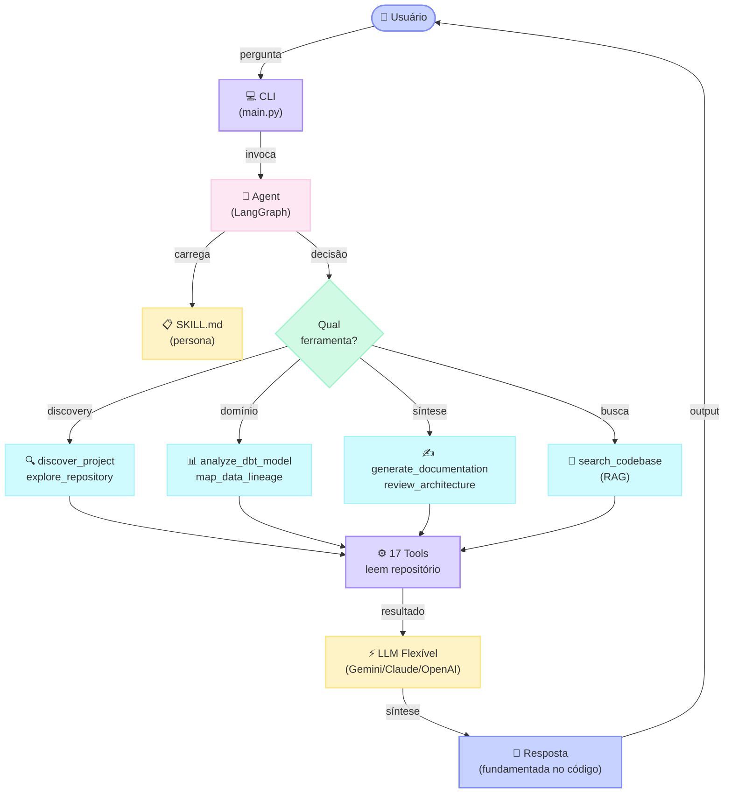
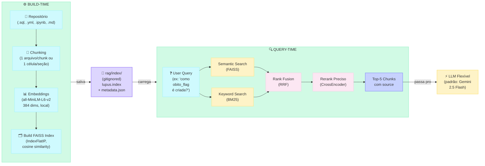

# Lupus — AI Code Intelligence Agent

**Projeto pessoal de estudos** em AI Engineering. Lupus é um agente conversacional para análise de repositórios — experimenta integração de LangGraph, ferramentas especializadas, busca semântica local e avaliação com LLM como juiz. 

O agente consulta os arquivos reais do projeto através de 17 ferramentas. Todas as respostas são fundamentadas no código-fonte analisado, sem extrapolações baseadas em conhecimento geral.

---

## Quick Start

```bash
# Setup (2 min)
git clone https://github.com/seu-usuario/lupus.git && cd lupus
python -m venv venv && source venv/bin/activate
pip install -r requirements.txt
cp .env.example .env
# Configure GOOGLE_API_KEY em https://aistudio.google.com/app/apikey

# Rodar (primeira vez: ~2 min para build do índice RAG)
python scripts/build_rag_index.py
python main.py
```

Teste com: `"Qual a arquitetura do projeto?"` ou `"Analisa https://github.com/dbt-labs/jaffle_shop"`

**Preferir interface HTTP?** Para usar via REST API (FastAPI) em vez de CLI, veja [LupusAPI](#lupusapi--camada-http). Os mesmos agente e ferramentas funcionam através de endpoints HTTP com documentação interativa.

---

## Índice

- [Capacidades](#capacidades) — 17 ferramentas para análise de repositórios
- [Arquitetura](#arquitetura) — Como funciona internamente
- [Stack Tecnológico](#stack-tecnológico) — Ferramentas e bibliotecas
- [Configuração](#configuração) — Setup, dependências e variáveis de ambiente
- [Configuração de Repositório](#configuração-de-repositório) — Como especificar qual repo analisar
- [Avaliação](#avaliação) — Métricas e dataset de teste
- [LupusAPI](#lupusapi--camada-http) — REST API com FastAPI
- [Troubleshooting](#troubleshooting) — Problemas comuns e soluções
- [Blocos de Desenvolvimento](#blocos-de-desenvolvimento) — Histórico de implementação
- [Learn More](#learn-more) — Outros documentos

---

## Capacidades

O agente fornece análise técnica de repositórios através de 17 ferramentas organizadas em 4 categorias:

### Ferramentas de Discovery (5)

Mapeamento automático e exploração inicial do repositório:
- `discover_project`: detecção de stack tecnológico (dbt, Node.js, Go, Java, Terraform, Kubernetes, Docker, Jupyter notebooks)
- `explore_repository`: enumeração de estrutura de arquivos com análise de padrões de segurança
- `read_data_file`: análise de dados estruturados (CSV, JSON, Parquet, Excel)
- `clone_repository`: clonagem de repositórios GitHub públicos com atualização automática do contexto
- `analyze_full_repository`: pipeline integrado de clonagem, exploração e análise

### Ferramentas de Análise de Domínio (7)

Análise estruturada de componentes específicos através da leitura de arquivos reais:
- `get_project_architecture`: análise de arquitetura (Medallion Architecture, modularização, fluxo de dados)
- `analyze_dbt_model`: análise de modelos dbt (camadas Bronze/Silver/Gold, transformações SQL, testes)
- `map_data_lineage`: rastreamento de linhagem de dados (origem até camadas finais)
- `analyze_pipeline_config`: análise de pipelines (DABs, schedule, deploy, orquestração)
- `get_data_dictionary`: extração de schema (colunas, tipos de dados, descrições por camada)
- `map_code_dependencies`: análise de grafo de dependências (imports Python/JS/TS/Go, bibliotecas externas)
- `get_agent_tools_spec`: especificação de agentes (tools, guardrails, integrações)

### Sub-agentes para Síntese (4)

Análise de nível superior através de invocação interna do LLM:
- `analyze_code`: leitura e explicação de arquivo específico
- `generate_documentation`: geração de documentação em formato Markdown
- `review_architecture`: análise crítica de decisões arquiteturais
- `suggest_improvements`: recomendações baseadas em análise do repositório

### Busca Semântica (1)

- `search_codebase`: busca híbrida no código-fonte (FAISS para busca vetorial + BM25 para busca por palavra-chave + RRF para fusão de rankings + CrossEncoder para reranking)

## Geração de Documentação

A ferramenta `generate_documentation` produz documentação a partir da análise do repositório. Suporta múltiplos estilos e formatos:

**Estilos disponíveis:**
- `markdown` (padrão): Documentação estruturada em Markdown
- `diagram`: Fluxogramas Mermaid e diagramas visuais

**Formatos de citação:**
- ABNT (padrão): Formatação brasileira
- APA: American Psychological Association
- Chicago: Estilo Chicago Manual of Style

**Exemplos de uso:**

```
"Gera documentação completa da arquitetura"
"Cria diagrama em Markdown da linhagem de dados"
"Documenta as transformações principais do dbt em formato APA"
"Gera diagrama visual da arquitetura em estilo diagram"
```

A documentação gerada é salva automaticamente no diretório do projeto analisado.

---

## Arquitetura

### Fluxo de uma pergunta



---

### Pipeline RAG — como `search_codebase` funciona internamente



---

### Quando o agente escolhe cada tool

| Pergunta do usuário | Tool acionada |
|---|---|
| "Quais tecnologias esse projeto usa?" | `discover_project` |
| "Me mostra a estrutura de arquivos do projeto" | `explore_repository` |
| "Tem algum CSV aqui? Me mostra as colunas" | `read_data_file` |
| "Analisa o repositório github.com/dbt-labs/jaffle_shop" | `analyze_full_repository` |
| "Qual a arquitetura do projeto?" | `get_project_architecture` |
| "O que faz este modelo SQL?" | `analyze_dbt_model` |
| "Como os dados fluem entre as camadas?" | `map_data_lineage` |
| "Qual o schedule do pipeline?" | `analyze_pipeline_config` |
| "Quais colunas estão disponíveis?" | `get_data_dictionary` |
| "Como o projeto usa o LLM?" | `get_agent_tools_spec` |
| "Quais módulos esse projeto importa mais?" | `map_code_dependencies` |
| "Leia o arquivo X para mim" | `analyze_code` |
| "Gere documentação da arquitetura" | `generate_documentation` |
| "Por que essa decisão arquitetural foi tomada?" | `review_architecture` |
| "Quais melhorias você sugere pro projeto?" | `suggest_improvements` |
| "Sugira melhorias focadas em performance" | `suggest_improvements` (com parâmetro `focus`) |
| "Como campos derivados são criados no SQL?" | `search_codebase` |

## Stack Tecnológico

| Componente | Tecnologia | Justificativa |
|-----------|-----------|-----------|
| Framework de Agentes | DeepAgents (LangChain + LangGraph) | Memória de conversa com estado e middleware plugável |
| LLM | Flexível (Gemini, Claude, OpenAI, OpenAI-compatible) | Configurável via `LLM_PROVIDER` — padrão: Gemini 2.5 Flash. OpenAI-compatible inclui Ollama, LM Studio, OpenRouter |
| Busca Semântica | FAISS (local) + BM25 + RRF + CrossEncoder | Pipeline híbrido, sem API externa, dados locais |
| Framework CLI | Rich | Formatação estruturada de output (markdown, painéis, indicadores) |
| Sistema de Persona | SKILL.md + SkillsMiddleware | Instruções contextualizadas, comportamento consistente |
| Persistência de Conversas | SQLite | Memória multi-turn com suporte a checkpoint |
| Observabilidade | LangSmith (opcional) | Rastreamento automático, logging de invocação |
| Embeddings | sentence-transformers / HuggingFace | all-MiniLM-L6-v2, 384 dims, local (sem APIs externas) |

### Customizar Persona e Comportamento

O arquivo `skills/lupus/SKILL.md` define a persona, tom, limites e regras do agente. Você pode editar este arquivo para customizar o comportamento:

```markdown
# skills/lupus/SKILL.md
Você é Lupus, assistente especializado em análise de repositórios...
Seu tom: Profissional e técnico
Limite de contexto: 8KB por arquivo
```

**Hot reload automático:** O agente detecta automaticamente mudanças em `SKILL.md` e recarrega a persona sem necessidade de restart. Após salvar o arquivo, a próxima pergunta já utilizará a nova persona.

Exemplo: Se editar o tom de "profissional" para "casual", a próxima resposta refletirá essa mudança.

### Decisões de Design

- **Busca semântica local**: FAISS opera offline sem APIs externas. Dados sensíveis do repositório não saem da máquina do usuário.
- **Contexto em tempo real**: As ferramentas consultam arquivos reais do projeto; sem dependência de datas de treinamento.
- **Arquitetura modular**: Cada ferramenta é independentemente implantável e testável.
- **Auto-documentação**: O agente gera documentação descrevendo o repositório analisado.
- **Persona configurável**: Comportamento do agente é definido em arquivo editável com hot reload.

### Dependência Alpha: DeepAgents 0.5.0a2

O Lupus usa **DeepAgents 0.5.0a2** em operação estável. Essa versão alpha foi escolhida como dependência fixa porque oferece recursos avançados de middleware e memória de conversa que não estão disponíveis em versões estáveis anteriores.

**Considerações conhecidas:**
- Streaming pode ter timeout em contextos muito grandes (> 20KB)
- Requisições simultâneas podem em raros casos apresentar race conditions
- API pode sofrer mudanças entre versões alpha

**Como verificar se é um problema do DeepAgents:**
1. A resposta começa bem mas depois trava ou timeout?
2. Você consegue fazer a mesma pergunta com um arquivo menor e funciona?
3. Veja o troubleshooting em [MAINTENANCE.md](MAINTENANCE.md#troubleshooting-de-desenvolvimento)

---

## Estrutura do Projeto

```
lupus/
├── Pontos de Entrada
│   ├── main.py                    # Interface CLI
│   ├── config.py                  # Configuração central (LLM, ferramentas, middleware)
│   └── .env.example               # Template de variáveis de ambiente
│
├── Agente Principal
│   ├── core/
│   │   ├── context_manager.py     # Gerenciamento de estado e hooks de contexto
│   │   └── repo_context.py        # Metadados de repositório (caminho, cache, RAG sync)
│   └── skills/lupus/SKILL.md      # Definição de persona e restrições de comportamento
│
├── Ferramentas (17 total)
│   ├── tools/__init__.py          # Registro e exportação de ferramentas
│   │
│   ├── Ferramentas de Discovery (5)
│   │   ├── project_discovery.py   # Detecção de stack
│   │   ├── repository_explorer.py # Enumeração de estrutura de arquivos
│   │   ├── data_file_reader.py    # Análise de dados estruturados
│   │   ├── github_integration.py  # Clonagem de repositórios
│   │   └── full_analysis.py       # Pipeline de discovery combinado
│   │
│   ├── Ferramentas de Domínio (7)
│   │   ├── architecture.py        # Análise de arquitetura
│   │   ├── dbt_analyzer.py        # Análise de modelos dbt
│   │   ├── lineage.py             # Rastreamento de linhagem de dados
│   │   ├── pipeline_analyzer.py   # Análise de configuração de pipelines
│   │   ├── data_dictionary.py     # Extração de schema
│   │   ├── code_dependencies.py   # Análise de grafo de dependências
│   │   └── agent_analyzer.py      # Especificação de agentes
│   │
│   ├── Sub-agentes (4)
│   │   └── subagents.py           # analyze_code, generate_documentation, review, suggest
│   │
│   ├── Ferramentas RAG (1)
│   │   └── rag_search.py          # Busca semântica
│   │
│   └── Utilitários
│       ├── cache.py               # Cache com TTL
│       └── path_helpers.py        # Utilitários de resolução de caminho
│
├── Módulo RAG
│   ├── rag/
│   │   ├── indexer.py             # Chunking semântico + builder de índice FAISS
│   │   ├── retriever.py           # Busca híbrida + reranking com CrossEncoder
│   │   └── index/                 # Índices gerados (gitignored)
│
├── API REST (FastAPI)
│   ├── api/
│   │   ├── main.py                # Servidor FastAPI + uvicorn
│   │   ├── dependencies.py        # Injeção de dependência (agente, LLM)
│   │   ├── middleware.py          # Logging e tracing middleware
│   │   ├── routers/               # Endpoints (/chat, /tools, /eval/run, /health)
│   │   ├── schemas/               # Modelos Pydantic (request/response)
│   │   ├── services/              # Lógica de negócio (agent_service, eval_service)
│   │   └── README.md              # Documentação da API
│
├── Testes e Avaliação
│   ├── tests/                     # Testes de integração
│   ├── evaluation/
│   │   ├── dataset.json           # Dataset de teste (25 exemplos)
│   │   ├── run_evaluation.py      # Harness de avaliação com LLM como juiz
│   │   └── results.json           # Resultados da avaliação
│   └── scripts/
│       ├── build_rag_index.py     # Builder de índice RAG
│       ├── generate_docs.py       # Gerador de documentação
│       └── validate_skill_consistency.py  # Valida persona em SKILL.md
│
├── Documentação
│   ├── README.md
│   └── AGENTS.md                  # Contexto e diretrizes do agente
```

### Fluxo de Dados

```
Query de Entrada (main.py)
         ↓
    config.make_agent() → Executor LangGraph
         ↓
    Stack de Middleware (Skills, Memory, Filesystem)
         ↓
    Gemini 2.5 Flash (raciocínio + seleção de ferramentas)
         ↓
    Invocação de Ferramentas (discovery, domínio, RAG, sub-agentes)
         ↓
    I/O de Arquivo + Busca Semântica (pipeline RAG)
         ↓
    Síntese de Resposta do LLM
         ↓
    Formatação de Output via Rich CLI
         ↓
    Output do Usuário
```

## Configuração

### Setup Detalhado

```bash
# 1. Clonar repositório
git clone https://github.com/seu-usuario/lupus.git
cd lupus

# 2. Criar ambiente virtual
python -m venv venv
source venv/bin/activate  # Linux/macOS
# ou: venv\Scripts\activate  # Windows

# 3. Instalar dependências
# Para PRODUÇÃO (dependências fixas, reproduzível):
pip install -r requirements.lock

# Para DESENVOLVIMENTO (versões mais flexíveis):
pip install -r requirements.txt

# 4. Configurar ambiente
cp .env.example .env
# OBRIGATÓRIO: Configure GOOGLE_API_KEY de https://aistudio.google.com/app/apikey
# OPCIONAL: Configure PROJECT_PATH para especificar o repositório alvo

# 5. Build do índice RAG (primeira vez apenas, ~2 minutos)
python scripts/build_rag_index.py

# 6. Iniciar agente
python main.py
```

### Gerenciamento de Dependências

O projeto mantém dois arquivos de requisitos:

| Arquivo | Uso | Vantagens |
|---------|-----|-----------|
| `requirements.lock` | **Produção** e CI/CD | Versões exatamente fixadas, builds reproduzíveis |
| `requirements.txt` | **Desenvolvimento** | Versões com maior flexibilidade (>=), mais fácil adicionar/atualizar dependências |

**Fluxo Recomendado:**
- Produção: `pip install -r requirements.lock` — garante exatamente as versões testadas
- Dev: `pip install -r requirements.txt` — permite minor/patch updates automáticas

Para atualizar o lockfile após mudar requirements.txt:
```bash
pip freeze > requirements.lock
git add requirements.lock
git commit -m "chore: update lockfile"
```

---

## Configuração de Repositório

O agente pode ser direcionado para analisar diferentes repositórios através de três mecanismos:

### Método 1: Configuração estática via `.env`

Configure a variável `PROJECT_PATH` no arquivo `.env` com o caminho absoluto do repositório:

```env
# .env
# OBRIGATÓRIO: Provedor LLM e chaves
LLM_PROVIDER=gemini  # ou: claude, openai, openai_compat
GOOGLE_API_KEY=sua-chave-do-google-aqui
# ANTHROPIC_API_KEY=sua-chave-se-usar-claude  # Comentado se não usar Claude
# OPENAI_API_KEY=sua-chave-se-usar-openai  # Comentado se não usar OpenAI

# OBRIGATÓRIO: Repositório a analisar
PROJECT_PATH=/Users/seu-usuario/Documentos/meu-projeto-python
# ou no Windows: PROJECT_PATH=C:\Users\seu-usuario\Documents\meu-projeto-python

# OPCIONAL: Configuração avançada
LUPUS_MAX_CONTEXT_BYTES=8000  # Máximo de bytes por arquivo (padrão: 8000)
LANGCHAIN_TRACING_V2=false    # true para habilitar LangSmith tracing

# OPCIONAL: Configuração da API (se rodar com FastAPI)
API_HOST=0.0.0.0
API_PORT=8000
API_RELOAD=true
API_LOG_LEVEL=info
API_AGENT_TIMEOUT=180
```

Veja `.env.example` para a lista completa de variáveis disponíveis.

Após editar `.env`, reinicie o agente:
```bash
python main.py
```

Todas as ferramentas operarão sobre o repositório especificado até uma nova configuração.

### Método 2: Clone dinâmico via interface de chat

Durante a execução, o usuário pode fornecer uma URL de repositório GitHub. A ferramenta `clone_repository` realiza o clone e atualiza automaticamente o contexto de análise sem necessidade de restart:

```
Entrada: "Analisa o repositório https://github.com/dbt-labs/jaffle_shop"

Saída: Repositório clonado com sucesso. PROJECT_PATH atualizado. 
       Todas as ferramentas agora operam em jaffle_shop.
```

Exemplos de repositórios para teste:
- `https://github.com/dbt-labs/jaffle_shop` (projeto de referência dbt)
- `https://github.com/apache/airflow` (framework de orquestração)

### Método 3: Troca de contexto durante sessão

Forneça uma URL diferente para mudar o repositório em análise:

```
Entrada: "Muda para https://github.com/apache/airflow"
Saída: Repositório clonado e carregado.
```

### Precedência de Configuração

| Precedência | Origem | Comportamento |
|---|---|---|
| 1 | `PROJECT_PATH` em `.env` | Repositório configurado na inicialização |
| 2 | URL fornecida via chat | Sobrescreve PROJECT_PATH durante sessão |

**Importante:** Você **deve** configurar um repositório. Sem configuração, o agente não funciona.

### Comandos CLI

Durante a sessão interativa, você pode usar os seguintes comandos slash:

| Comando | Descrição | Exemplo |
|---------|-----------|---------|
| `/repo <url>` | Muda repositório para análise (GitHub público apenas) | `/repo https://github.com/dbt-labs/jaffle_shop` |
| `/status` | Mostra status do agente e configuração atual | `/status` |
| `/export <formato>` | Exporta conversa em formato especificado | `/export json` ou `/export md` |
| `/limpar` | Limpa histórico de conversa e começa do zero | `/limpar` |
| `/reportar` | Gera relatório técnico da análise até o momento | `/reportar` |
| `/comandos` | Lista todos os comandos CLI disponíveis | `/comandos` |

Todos os comandos começam com `/` e são case-insensitive. Utilize-os para controlar a sessão sem formular perguntas.

### Limite de Contexto por Análise

O Lupus limita o tamanho de arquivo lido em cada análise para evitar timeouts e excesso de uso de tokens. Padrão: **8000 bytes (8 KB)**.

Configure via variável de ambiente:
```bash
# Aumentar para análises maiores (ex: 20KB)
export LUPUS_MAX_CONTEXT_BYTES=20000

# Após definir, execute novamente
python main.py
```

**Trade-offs:**
| Limite | Vantagem | Desvantagem |
|--------|----------|------------|
| 8 KB (padrão) | ✓ Rápido, confiável | ✗ Contexto limitado |
| 16 KB | ✓ Mais contexto | ✗ Pode lentificar |
| 20+ KB | ✓ Análises maiores | ✗ Alto risco de timeout (>50KB gera warning) |

---

## Avaliação

O agente foi avaliado em 25 perguntas técnicas em 5 categorias usando um dataset de teste com scoring de LLM como juiz.

### Métricas Gerais

| Métrica | Valor | Descrição |
|--------|-------|-----------|
| Acurácia | 96% (24/25) | Perguntas respondidas corretamente segundo LLM juiz |
| Correspondência de Keywords | 85% | Presença de palavras-chave esperadas nas respostas |
| Cobertura de Ferramentas | 82% | % de perguntas onde o agente usou a(s) ferramenta(s) correta(s) |
| Completude (juiz) | 4.8/5.0 | Respostas completas e não-incompletas (escala 1-5) |
| Relevância | 5.0/5.0 | Respostas relevantes para a pergunta formulada (escala 1-5) |
| Fundamentação | 5.0/5.0 | Respostas fundamentadas no código-fonte (escala 1-5) |

### Análise por Categoria

| Categoria | Acurácia | Cobertura | Completude |
|----------|----------|----------------|--------------|
| Arquitetura | 100% | 100% | 5.0 |
| Módulos | 82% | 80% | 5.0 |
| Integração | 88% | 50% | 5.0 |
| Design | 81% | 80% | 4.8 |
| RAG | 76% | 100% | 4.4 |

### Executar Avaliação

```bash
python evaluation/run_evaluation.py
```

Os resultados são escritos em `evaluation/results.json`.

---

## LupusAPI — Camada HTTP

O Lupus também expõe o agente via REST API, construída com FastAPI. A interface HTTP mantém o mesmo núcleo do agente — `config.py`, tools, RAG — sem modificações, adicionando uma camada de transporte e observabilidade.

### Como rodar

As dependências da API (FastAPI, Uvicorn) já estão em `requirements.txt`. Suba o servidor:

```bash
uvicorn api.main:app --reload --host 0.0.0.0 --port 8000
```

Aguarde a mensagem `Application startup complete.` O startup leva ~5–10s (carrega o agente).

Documentação interativa disponível em `http://localhost:8000/docs` (Swagger UI).

### Endpoints

| Método | Endpoint | Descrição |
|---|---|---|
| `POST` | `/chat` | Envia mensagem ao agente com suporte a multi-turn |
| `GET` | `/tools` | Lista todas as 17 tools disponíveis |
| `POST` | `/eval/run` | Executa avaliações automáticas via LangSmith |
| `GET` | `/health` | Status do servidor |

**POST /chat** — Conversar com o agente

```json
// Request
{
  "message": "Qual a arquitetura do projeto?",
  "session_id": "user-123"  // Permite histórico multi-turn
}

// Response
{
  "response": "O projeto usa Medallion Architecture com 3 camadas...",
  "tools_used": ["get_project_architecture", "analyze_dbt_model"],
  "latency_ms": 4213.50
}
```

**GET /tools** — Lista de ferramentas disponíveis

```json
// Response
{
  "tools": [
    {
      "name": "discover_project",
      "description": "Detecção de stack tecnológico"
    },
    ...
  ]
}
```

**POST /eval/run** — Executar avaliações

```json
// Request
{
  "evaluators": ["all"],  // ou ["correctness", "tool_usage", "latency"]
  "max_examples": 3  // Número de exemplos para avaliar
}

// Response
{
  "experiment_url": "https://smith.langchain.com/experiments/abc123",
  "results": {
    "correctness": 0.95,
    "tool_usage": 0.82,
    "latency_score": 0.88
  }
}
```

**GET /health** — Status do servidor

```json
// Response (200 OK)
{
  "status": "healthy",
  "agent": "ready",
  "langsmith": "connected"
}

// Response (503 Service Unavailable)
{
  "status": "unhealthy",
  "agent": "failed",
  "error": "Agent initialization failed"
}
```

### Exemplo rápido

```bash
# Conversar com o agente via HTTP
curl -X POST http://localhost:8000/chat \
  -H "Content-Type: application/json" \
  -d '{"message": "Qual a arquitetura do projeto?", "session_id": "sessao-1"}'

# Verificar saúde do sistema
curl http://localhost:8000/health

# Avaliação rápida com 3 exemplos
curl -X POST http://localhost:8000/eval/run \
  -H "Content-Type: application/json" \
  -d '{"evaluators": ["all"], "max_examples": 3}'
```

### Observabilidade

Cada request gera um log com `request_id` único, método, path, status HTTP e latência:

```
INFO  request_id=a3f2b1c4  method=POST  path=/chat  status=200  latency_ms=4213.50  ip=127.0.0.1
```

O header `X-Request-ID` é injetado em todas as responses para correlacionar logs com erros.

Com `LANGCHAIN_TRACING_V2=true`, todas as chamadas ao agente aparecem automaticamente no dashboard LangSmith com traces de cada tool call.

### Avaliação via API

O endpoint `/eval/run` usa o LangSmith SDK para criar experimentos rastreáveis:

```
Dataset (dataset.json, 25 exemplos)
    ↓
langsmith.evaluate(agente, evaluators=[correctness, tool_usage, latency])
    ↓
Experimento histórico em smith.langchain.com
```

Os evaluators medem: presença de keywords esperadas, cobertura de tools corretas, e latência convertida em score (0–1).

### Contexto e limitações

O Lupus é um **projeto de aprendizado**. A LupusAPI foi construída para explorar FastAPI, injeção de dependência assíncrona, e integração com o SDK do LangSmith — não para ser um produto em produção.

A API não tem autenticação. Isso é intencional para manter o escopo focado no que o projeto se propõe a ensinar. Qualquer pessoa com acesso à rede pode chamar os endpoints — o que é aceitável num ambiente local de desenvolvimento, mas não num contexto público ou de cliente real.

Documentação completa do módulo: [`api/README.md`](api/README.md).

---

## Motivação e Abordagem

Análise de repositórios em escala apresenta desafios:
- Documentação diverge rapidamente da implementação
- Onboarding requer grande investimento de tempo
- Arquiteturas complexas demandam compreensão precisa e em tempo real

Lupus aborda esses desafios através de:
- **Respostas fundamentadas**: Todas as respostas derivam do código real do repositório
- **Sem APIs externas**: Busca semântica local preserva privacidade de dados
- **Documentação automática**: Gera documentação técnica atual e precisa
- **Agnóstico a stack**: Opera com dbt, Python, Node.js, Terraform, Kubernetes, etc.
- **Arquitetura extensível**: Ferramentas são modulares e independentemente testáveis
- **Validado empiricamente**: 96% de acurácia em dataset de perguntas técnicas

---

## Blocos de Desenvolvimento

| Bloco | Descrição |
|-------|-----------|
| 1 | Setup de ambiente, DeepAgents, integração Gemini |
| 2 | Ferramentas de discovery (detecção de stack, exploração) |
| 3 | Ferramentas de domínio e orquestração de agentes |
| 4 | Persona (SKILL.md), interface CLI |
| 5 | Geração de documentação |
| 6 | Avaliação quantitativa (25 perguntas, LLM como juiz) |
| 7 | Polish (README, requirements, organização) |
| 8 | Pipeline RAG (FAISS + BM25 + RRF + CrossEncoder) |
| 9 | LupusAPI Fase 1 — FastAPI, Swagger, endpoints mock, schemas Pydantic |
| 10 | LupusAPI Fase 2 — Integração agente real, session_id, tratamento de erros |
| 11 | LupusAPI Fase 3 — LangSmith evals dataset + evaluators + POST /eval/run |
| 12 | LupusAPI Fase 4 — Logging middleware, GET /health, .env.example, README |

---

## Troubleshooting

### Agente congela ou não responde

**Sintoma:** Lupus fica travado ao fazer uma pergunta.

**Causas e Soluções:**

1. **Contexto do repositório muito grande**
   - O agente limita análises a 8KB de conteúdo para evitar timeouts
   - Solução: Faça perguntas mais específicas
   - Exemplo: Ao invés de "analise tudo", tente "qual a estrutura do Bronze?"

2. **Timeout de 3 minutos atingido**
   - O agente tem limite de 180s para responder
   - Solução: 
     - Tente novamente com pergunta mais simples
     - Mude de repositório com `/repo <URL>`
     - Se usar busca semântica, rode `python scripts/build_rag_index.py` para reindexar

3. **Índice RAG desatualizado**
   - Se clonou um repositório novo, o índice FAISS pode estar desincronizado
   - Solução: `python scripts/build_rag_index.py`
   - O agente avisa quando detecta mismatch

### HuggingFace model download trava

**Sintoma:** Primeira execução fica presa ao baixar modelos de embeddings.

**Causa:** Conexão instável com HuggingFace hub ou timeout de download.

**Solução:**
- Aguarde até 5 minutos (primeiro download baixa ~380MB)
- Se timeout persistir, defina variável de ambiente:
  ```bash
  export HF_HUB_DOWNLOAD_TIMEOUT=600
  ```

### RAG warnings aparecem

**Sintoma:** "O índice RAG está desatualizado para este repositório"

**Causa:** Você clonou um repositório novo, mas o índice FAISS ainda é de outro repo.

**Solução:**
```bash
python scripts/build_rag_index.py
```

O agente detecta automaticamente e avisa quando isso acontece.

### Erro ao clonar repositório

**Sintoma:** "git clone falhou"

**Causas:**
- URL inválida ou repositório privado (Lupus acessa apenas repos públicos)
- Sem conexão com GitHub

**Solução:**
- Verifique se a URL é pública e válida
- Teste em outro terminal: `git clone <URL>`

### Problema ao ler arquivo

**Sintoma:** "Arquivo não encontrado" ao usar `analyze_code`

**Causa:** Caminho do arquivo está fora do repositório configurado.

**Solução:**
- Use caminhos relativos: `models/silver/arquivo.sql` (não caminho absoluto)
- Confirme se o arquivo existe no repo com `/repo` info

### DeepAgents não instala

**Sintoma:** "deepagents not found" ou erro de instalação.

**Solução:**
1. Confirme Python 3.11+: `python --version`
2. Upgrade pip: `pip install --upgrade pip`
3. Instale deepagents 0.5.0+: `pip install deepagents==0.5.0a2`

Se ainda falhar, crie venv nova:
```bash
python -m venv venv
source venv/bin/activate  # Windows: venv\Scripts\activate
pip install -r requirements.txt
```

---

---

## Learn More

| Documento | Conteúdo |
|-----------|----------|
| [AGENTS.md](AGENTS.md) | Contexto e persona do agente — quando usar cada ferramenta |
| [TOOLS.md](TOOLS.md) | Referência completa das 17 ferramentas com parâmetros e exemplos |
| [SKILL.md](skills/lupus/SKILL.md) | Definição de persona, tom, limites e regras de comportamento |
| [MAINTENANCE.md](MAINTENANCE.md) | Guia para contributors — trocar LLM, modificar comportamento |
| [api/README.md](api/README.md) | Como rodar a REST API (FastAPI + Swagger) |
| [tests/README.md](tests/README.md) | Suite de testes (pytest) e como adicionar novos |

---

## Licença

Projeto acadêmico para fins educacionais e de pesquisa.

**Tecnologias:**
- **LLM:** Flexível — Gemini 2.5 Flash (padrão), Claude, OpenAI, ou compatível OpenAI via `LLM_PROVIDER`
- **Framework de agentes:** DeepAgents + LangChain + LangGraph
- **RAG:** FAISS (busca semântica) + BM25 (busca keyword) + CrossEncoder (reranking)
- **Observabilidade:** LangSmith (opcional, via `LANGCHAIN_TRACING_V2`)
