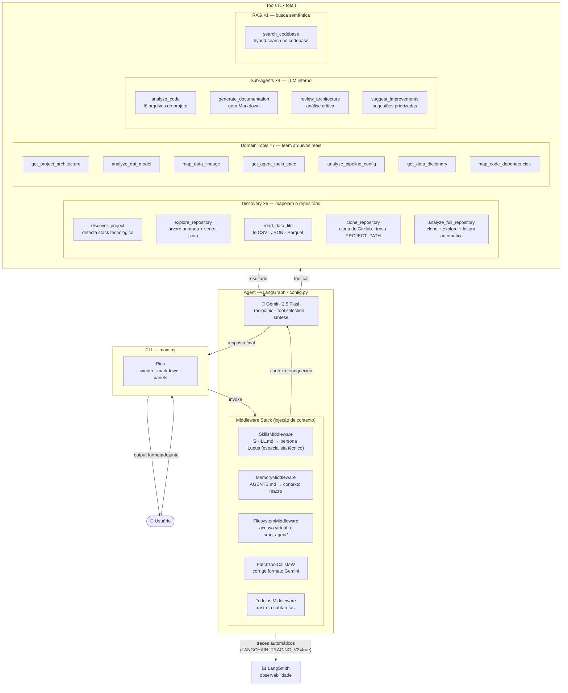
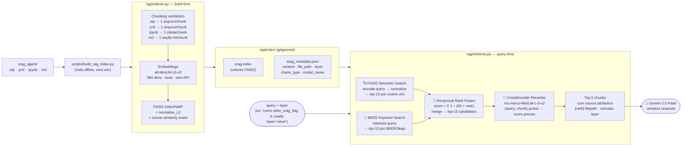

# Lupus

AI Code Intelligence Agent — analisa qualquer repositório técnico via conversação. Configure `PROJECT_PATH` para apontar para o repo que quiser analisar, ou use `clone_repository` para clonar diretamente do GitHub.

Desenvolvido como projeto acadêmico, explorando a construção de agentes de IA com [DeepAgents](https://github.com/deepagents) (LangChain/LangGraph) + Gemini 2.5 Flash.

## O que faz

O Lupus é um agente conversacional que responde perguntas técnicas sobre qualquer repositório configurado em `PROJECT_PATH`. Usa 17 tools especializadas que consultam os arquivos reais do projeto — nunca inventa.

### Capacidades

- **Descoberta automática**: detecta stack tecnológico (dbt, Node.js, Go, Java, Terraform, K8s, Docker, notebooks...)
- **Integração GitHub**: clona qualquer repositório público e troca de projeto sem reiniciar
- **Análise de arquitetura**: Medallion Architecture, módulos, fluxo de dados
- **Análise de modelos dbt**: Bronze, Silver, Gold — transformações, SQL, testes
- **Linhagem de dados**: rastreamento de fontes → Bronze → Silver → Gold
- **Análise de pipeline**: DABs, schedule, deploy, orquestração Databricks
- **Dicionário de dados**: colunas, tipos, descrições por camada
- **Dependências de código**: grafo de imports Python/JS/TS/Go — libs externas, acoplamento, entry points
- **Detecção de segredos**: alerta sobre possíveis secrets hardcoded no repositório
- **Análise de código**: leitura e explicação de qualquer arquivo do projeto
- **Busca semântica (RAG)**: hybrid search (FAISS + BM25 + RRF + CrossEncoder) no codebase real
- **Geração de documentação**: documentos Markdown a partir das tools de domínio
- **Review de arquitetura**: análise crítica de decisões técnicas
- **Sugestões de melhoria**: análise baseada em evidências do repositório real

## Arquitetura

### Fluxo de uma pergunta



---

### Pipeline RAG — como `search_codebase` funciona internamente



---

### Quando o agente escolhe cada tool

| Pergunta do usuário | Tool acionada |
|---|---|
| "Quais tecnologias esse projeto usa?" | `discover_project` |
| "Me mostra a estrutura de arquivos do projeto" | `explore_repository` |
| "Tem algum CSV aqui? Me mostra as colunas" | `read_data_file` |
| "Analisa o repositório github.com/dbt-labs/jaffle_shop" | `analyze_full_repository` |
| "Qual a arquitetura do projeto?" | `get_project_architecture` |
| "O que faz o silver_srag_data.sql?" | `analyze_dbt_model` |
| "Como os dados fluem do Bronze ao Gold?" | `map_data_lineage` |
| "Qual o schedule do pipeline?" | `analyze_pipeline_config` |
| "Quais colunas tem na Gold?" | `get_data_dictionary` |
| "Como o ai_agent usa o LLM?" | `get_agent_tools_spec` |
| "Quais módulos esse projeto importa mais?" | `map_code_dependencies` |
| "Leia o arquivo X para mim" | `analyze_code` |
| "Gere documentação da arquitetura" | `generate_documentation` |
| "Por que usaram ephemeral na Bronze?" | `review_architecture` |
| "Quais melhorias você sugere pro projeto?" | `suggest_improvements` |
| "Como `obito_srag_flag` é criada no SQL?" | `search_codebase` |

## Stack

| Componente | Tecnologia |
|---|---|
| Framework de agentes | DeepAgents (LangChain + LangGraph) |
| LLM | Gemini 2.5 Flash (Google AI) |
| RAG | FAISS + BM25 + RRF (sentence-transformers local) |
| Observabilidade | LangSmith (tracing automático via env vars) |
| Middleware | Filesystem, Memory, Skills, PatchToolCalls |
| Persona | Lupus (via SkillsMiddleware + SKILL.md) |
| CLI | Rich (panels, markdown, spinner) |
| Projeto padrão (demo) | SRAG — Databricks, dbt Core, Llama 3.3 70B |

## Estrutura

```
lupus/
├── main.py                        # CLI chat com Lupus
├── config.py                      # SYSTEM_PROMPT e make_agent() — fonte única de verdade
├── AGENTS.md                      # Contexto macro do agente (sem detalhes factuais)
├── .env.example                   # Template de variáveis de ambiente
├── requirements.txt               # Dependências Python
├── tools/                         # 5 discovery + 7 domain + 4 sub-agents + 1 RAG = 17 tools
│   ├── __init__.py
│   ├── cache.py                   # TTL cache (5 min) compartilhado pelas domain tools
│   ├── project_discovery.py       # discover_project (detecta stack: dbt, Node, Go, K8s, etc.)
│   ├── repository_explorer.py     # explore_repository (árvore anotada + secret scan)
│   ├── data_file_reader.py        # read_data_file (CSV · JSON · Parquet · Excel)
│   ├── full_analysis.py            # analyze_full_repository (clone + explore + leitura em uma chamada)
│   ├── github_integration.py      # clone_repository (clona do GitHub, troca PROJECT_PATH)
│   ├── architecture.py            # get_project_architecture
│   ├── dbt_analyzer.py            # analyze_dbt_model
│   ├── lineage.py                 # map_data_lineage
│   ├── agent_analyzer.py          # get_agent_tools_spec
│   ├── pipeline_analyzer.py       # analyze_pipeline_config
│   ├── data_dictionary.py         # get_data_dictionary
│   ├── code_dependencies.py       # map_code_dependencies (grafo de imports Python/JS/TS/Go)
│   ├── subagents.py               # analyze_code, generate_documentation, review_architecture, suggest_improvements
│   └── rag_search.py              # search_codebase (RAG — hybrid semantic+keyword search)
├── rag/                           # Módulo RAG: indexer + retriever
│   ├── __init__.py
│   ├── indexer.py                 # Chunking semântico + FAISS index builder
│   ├── retriever.py               # Hybrid search: FAISS + BM25 + RRF
│   └── index/                     # Índice gerado offline (gitignored)
├── skills/
│   └── lupus/
│       └── SKILL.md               # Persona: tom, limites, regras
├── tests/                         # Testes automatizados
│   ├── test_tools.py              # 10 perguntas: domain + sub-agents
│   ├── test_new_tools.py          # 6 perguntas: discovery + explore + suggest
│   ├── test_persona.py            # 7 perguntas: persona Lupus
│   └── test_cross_tool.py         # 3 perguntas: cruzamento de tools
├── evaluation/                    # Avaliação quantitativa (Bloco 6)
│   ├── dataset.json               # 25 perguntas + keywords + tools esperadas
│   └── run_evaluation.py          # Script com retry + LLM-as-judge
├── scripts/
│   ├── generate_docs.py           # Geração automática de 5 docs
│   └── build_rag_index.py         # Pipeline de indexação RAG (roda uma vez offline)
├── docs/                          # Documentação do desenvolvimento
│   ├── bloco1_setup.md
│   ├── bloco2_tools.md
│   ├── bloco3_agent.md
│   ├── bloco4_skill_cli.md
│   ├── bloco5_documentacao.md
│   ├── bloco6_avaliacao.md
│   ├── bloco8_rag.md
│   └── problemas_gemini_deepagents.md
└── srag_agent/                    # Projeto SRAG (analisado pelo agente)
```

## Setup

```bash
# 1. Clone
git clone https://github.com/seu-usuario/lupus.git
cd lupus

# 2. Ambiente virtual
python -m venv venv
source venv/bin/activate  # Linux/Mac
# venv\Scripts\activate   # Windows

# 3. Dependências
pip install -r requirements.txt

# 4. API key + observabilidade
cp .env.example .env
# Obrigatório: GOOGLE_API_KEY (Google AI Studio)
# Opcional:    LANGCHAIN_* vars (LangSmith — ver .env.example)

# 5. Índice RAG (uma vez — ou após mudanças no srag_agent/)
python scripts/build_rag_index.py

# 6. Rodar
python main.py
```

## Avaliação

O agente foi avaliado com 25 perguntas técnicas em 5 categorias (arquitetura, módulos, integração, design, RAG):

| Métrica | Resultado |
|---|---|
| **Accuracy** | **96%** (24/25) |
| Keyword accuracy | 85% |
| Tool coverage | 82% |
| Completude (LLM-as-judge) | 4.8/5.0 |
| Relevância | 5.0/5.0 |
| Fundamentação | 5.0/5.0 |

| Categoria | Keywords | Tool coverage | Completude |
|---|---|---|---|
| Arquitetura | 100% | 100% | 5.0 |
| Módulos | 82% | 80% | 5.0 |
| Integração | 88% | 50% | 5.0 |
| Design | 81% | 80% | 4.8 |
| RAG | 76% | 100% | 4.4 |

```bash
# Rodar avaliação
python evaluation/run_evaluation.py
```

## Blocos de desenvolvimento

| Bloco | Descrição|
|---|---|
| 1 | Setup: ambiente, DeepAgents, Gemini |
| 2 | Domain Tools: 6 ferramentas de domínio |
| 3 | Agent: integração LangGraph + middleware + sub-agents |
| 4 | Skill + CLI: Lupus persona + chat interativo |
| 5 | Documentação: 5 docs gerados automaticamente |
| 6 | Avaliação: 25 perguntas, 3 níveis de métricas, 96% accuracy |
| 7 | Polish: README, requirements, organização, git |
| 8 | RAG: hybrid search (FAISS + BM25 + RRF), embeddings locais |

## Licença

Projeto acadêmico — uso educacional.
