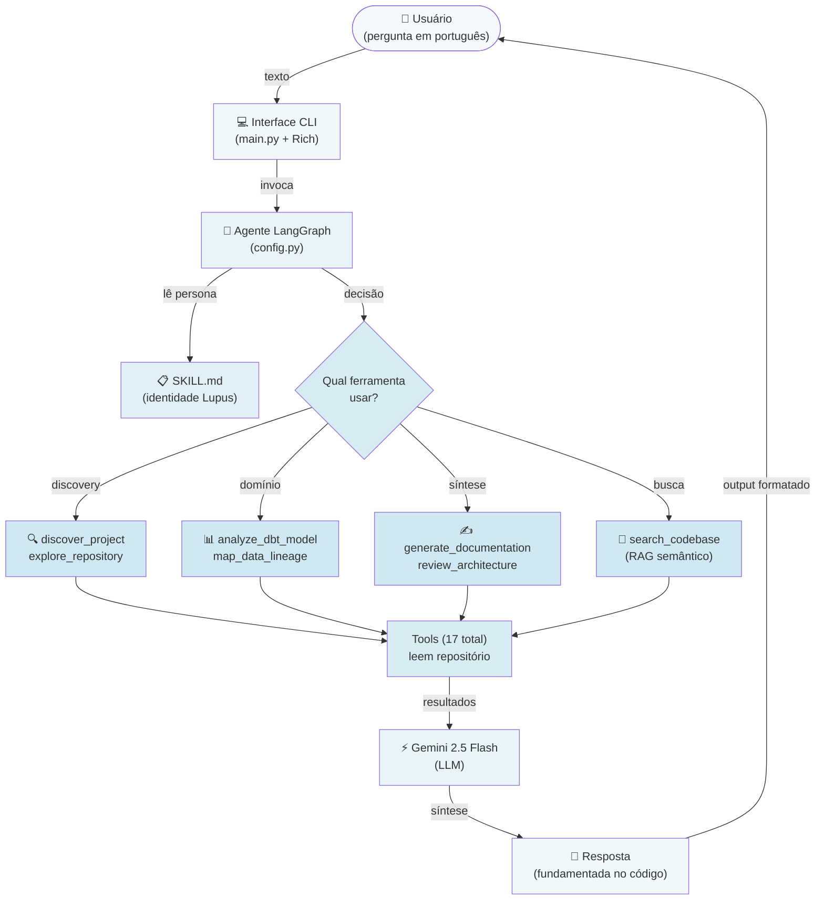
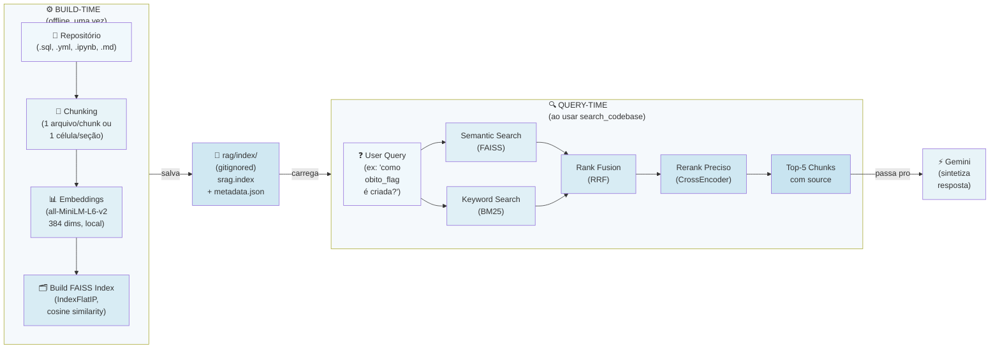

# Lupus — AI Code Intelligence Agent

Agente conversacional para análise de repositórios via interface de chat. O Lupus consulta os arquivos reais do projeto através de 17 ferramentas especializadas. Todas as respostas são fundamentadas no código-fonte analisado, sem extrapolações baseadas em conhecimento geral.

## Configuração

Especifique qual repositório analisar através de:
- **`.env`**: configure `PROJECT_PATH` com o caminho absoluto do repositório local
- **Chat interativo**: forneça uma URL do GitHub e o agente realizará clone automático sem necessidade de restart
- **Padrão**: se não configurado, analisa o projeto SRAG incluído no repositório

Implementado com [DeepAgents](https://github.com/deepagents) (LangChain + LangGraph) e Gemini 2.5 Flash.

## Capacidades

O agente fornece análise técnica de repositórios através de 17 ferramentas organizadas em 4 categorias:

### Ferramentas de Discovery (5)

Mapeamento automático e exploração inicial do repositório:
- `discover_project`: detecção de stack tecnológico (dbt, Node.js, Go, Java, Terraform, Kubernetes, Docker, Jupyter notebooks)
- `explore_repository`: enumeração de estrutura de arquivos com análise de padrões de segurança
- `read_data_file`: análise de dados estruturados (CSV, JSON, Parquet, Excel)
- `clone_repository`: clonagem de repositórios GitHub públicos com atualização automática do contexto
- `analyze_full_repository`: pipeline integrado de clonagem, exploração e análise

### Ferramentas de Análise de Domínio (7)

Análise estruturada de componentes específicos através da leitura de arquivos reais:
- `get_project_architecture`: análise de arquitetura (Medallion Architecture, modularização, fluxo de dados)
- `analyze_dbt_model`: análise de modelos dbt (camadas Bronze/Silver/Gold, transformações SQL, testes)
- `map_data_lineage`: rastreamento de linhagem de dados (origem até camadas finais)
- `analyze_pipeline_config`: análise de pipelines (DABs, schedule, deploy, orquestração)
- `get_data_dictionary`: extração de schema (colunas, tipos de dados, descrições por camada)
- `map_code_dependencies`: análise de grafo de dependências (imports Python/JS/TS/Go, bibliotecas externas)
- `get_agent_tools_spec`: especificação de agentes (tools, guardrails, integrações)

### Sub-agentes para Síntese (4)

Análise de nível superior através de invocação interna do LLM:
- `analyze_code`: leitura e explicação de arquivo específico
- `generate_documentation`: geração de documentação em formato Markdown
- `review_architecture`: análise crítica de decisões arquiteturais
- `suggest_improvements`: recomendações baseadas em análise do repositório

### Busca Semântica (1)

- `search_codebase`: busca híbrida no código-fonte (FAISS para busca vetorial + BM25 para busca por palavra-chave + RRF para fusão de rankings + CrossEncoder para reranking)

## Geração de Documentação

A ferramenta `generate_documentation` produz documentação em formato Markdown a partir da análise do repositório. Exemplos de uso:

```
"Gera documentação completa da arquitetura"
"Cria diagrama em Markdown da linhagem de dados"
"Documenta as transformações principais do dbt"
```

A documentação gerada é salva automaticamente no diretório do projeto analisado.

---

## Arquitetura

### Fluxo de uma pergunta



---

### Pipeline RAG — como `search_codebase` funciona internamente



---

### Quando o agente escolhe cada tool

| Pergunta do usuário | Tool acionada |
|---|---|
| "Quais tecnologias esse projeto usa?" | `discover_project` |
| "Me mostra a estrutura de arquivos do projeto" | `explore_repository` |
| "Tem algum CSV aqui? Me mostra as colunas" | `read_data_file` |
| "Analisa o repositório github.com/dbt-labs/jaffle_shop" | `analyze_full_repository` |
| "Qual a arquitetura do projeto?" | `get_project_architecture` |
| "O que faz o silver_srag_data.sql?" | `analyze_dbt_model` |
| "Como os dados fluem do Bronze ao Gold?" | `map_data_lineage` |
| "Qual o schedule do pipeline?" | `analyze_pipeline_config` |
| "Quais colunas tem na Gold?" | `get_data_dictionary` |
| "Como o ai_agent usa o LLM?" | `get_agent_tools_spec` |
| "Quais módulos esse projeto importa mais?" | `map_code_dependencies` |
| "Leia o arquivo X para mim" | `analyze_code` |
| "Gere documentação da arquitetura" | `generate_documentation` |
| "Por que usaram ephemeral na Bronze?" | `review_architecture` |
| "Quais melhorias você sugere pro projeto?" | `suggest_improvements` |
| "Como `obito_srag_flag` é criada no SQL?" | `search_codebase` |

## Stack Tecnológico

| Componente | Tecnologia | Justificativa |
|-----------|-----------|-----------|
| Framework de Agentes | DeepAgents (LangChain + LangGraph) | Memória de conversa com estado e middleware plugável |
| LLM | Gemini 2.5 Flash | Baixa latência, custo-efetivo, forte em tool-calling |
| Busca Semântica | FAISS (local) + BM25 + RRF + CrossEncoder | Pipeline híbrido, sem API externa, dados locais |
| Framework CLI | Rich | Formatação estruturada de output (markdown, painéis, indicadores) |
| Sistema de Persona | SKILL.md + SkillsMiddleware | Instruções contextualizadas, comportamento consistente |
| Persistência de Conversas | SQLite | Memória multi-turn com suporte a checkpoint |
| Observabilidade | LangSmith (opcional) | Rastreamento automático, logging de invocação |
| Projeto de Referência | SRAG | Pipeline de dados real (Databricks + dbt + agente LLM) |

### Decisões de Design

- **Busca semântica local**: FAISS opera offline sem APIs externas. Dados sensíveis do repositório não saem da máquina do usuário.
- **Contexto em tempo real**: As ferramentas consultam arquivos reais do projeto; sem dependência de datas de treinamento.
- **Arquitetura modular**: Cada ferramenta é independentemente implantável e testável.
- **Auto-documentação**: O agente gera documentação descrevendo o repositório analisado.

## Estrutura do Projeto

```
lupus/
├── Pontos de Entrada
│   ├── main.py                    # Interface CLI
│   ├── config.py                  # Configuração central (LLM, ferramentas, middleware)
│   └── .env.example               # Template de variáveis de ambiente
│
├── Agente Principal
│   ├── core/
│   │   ├── context_manager.py     # Gerenciamento de estado e hooks de contexto
│   │   └── repo_context.py        # Metadados de repositório (caminho, cache, RAG sync)
│   └── skills/lupus/SKILL.md      # Definição de persona e restrições de comportamento
│
├── Ferramentas (17 total)
│   ├── tools/__init__.py          # Registro e exportação de ferramentas
│   │
│   ├── Ferramentas de Discovery (5)
│   │   ├── project_discovery.py   # Detecção de stack
│   │   ├── repository_explorer.py # Enumeração de estrutura de arquivos
│   │   ├── data_file_reader.py    # Análise de dados estruturados
│   │   ├── github_integration.py  # Clonagem de repositórios
│   │   └── full_analysis.py       # Pipeline de discovery combinado
│   │
│   ├── Ferramentas de Domínio (7)
│   │   ├── architecture.py        # Análise de arquitetura
│   │   ├── dbt_analyzer.py        # Análise de modelos dbt
│   │   ├── lineage.py             # Rastreamento de linhagem de dados
│   │   ├── pipeline_analyzer.py   # Análise de configuração de pipelines
│   │   ├── data_dictionary.py     # Extração de schema
│   │   ├── code_dependencies.py   # Análise de grafo de dependências
│   │   └── agent_analyzer.py      # Especificação de agentes
│   │
│   ├── Sub-agentes (4)
│   │   └── subagents.py           # analyze_code, generate_documentation, review, suggest
│   │
│   ├── Ferramentas RAG (1)
│   │   └── rag_search.py          # Busca semântica
│   │
│   └── Utilitários
│       ├── cache.py               # Cache com TTL
│       └── path_helpers.py        # Utilitários de resolução de caminho
│
├── Módulo RAG
│   ├── rag/
│   │   ├── indexer.py             # Chunking semântico + builder de índice FAISS
│   │   ├── retriever.py           # Busca híbrida + reranking com CrossEncoder
│   │   └── index/                 # Índices gerados (gitignored)
│
├── Testes e Avaliação
│   ├── tests/                     # Testes de integração
│   ├── evaluation/
│   │   ├── dataset.json           # Dataset de teste (25 perguntas)
│   │   └── run_evaluation.py      # Harness de avaliação com LLM como juiz
│   └── scripts/
│       ├── build_rag_index.py     # Builder de índice RAG
│       └── generate_docs.py       # Gerador de documentação
│
├── Documentação
│   ├── docs/                      # Documentação de desenvolvimento
│   ├── README.md
│   └── AGENTS.md                  # Contexto e diretrizes do agente
│
└── Projeto de Referência
    └── srag_agent/                # Projeto exemplo (Databricks + dbt + LLM)
```

### Fluxo de Dados

```
Query de Entrada (main.py)
         ↓
    config.make_agent() → Executor LangGraph
         ↓
    Stack de Middleware (Skills, Memory, Filesystem)
         ↓
    Gemini 2.5 Flash (raciocínio + seleção de ferramentas)
         ↓
    Invocação de Ferramentas (discovery, domínio, RAG, sub-agentes)
         ↓
    I/O de Arquivo + Busca Semântica (pipeline RAG)
         ↓
    Síntese de Resposta do LLM
         ↓
    Formatação de Output via Rich CLI
         ↓
    Output do Usuário
```

## Setup

```bash
# 1. Clonar repositório
git clone https://github.com/seu-usuario/lupus.git
cd lupus

# 2. Criar ambiente virtual
python -m venv venv
source venv/bin/activate  # Linux/macOS
# ou: venv\Scripts\activate  # Windows

# 3. Instalar dependências
# Para PRODUÇÃO (dependências fixas, reproduzível):
pip install -r requirements.lock

# Para DESENVOLVIMENTO (versões mais flexíveis):
pip install -r requirements.txt

# 4. Configurar ambiente
cp .env.example .env
# OBRIGATÓRIO: Configure GOOGLE_API_KEY de https://aistudio.google.com/app/apikey
# OPCIONAL: Configure PROJECT_PATH para especificar o repositório alvo

# 5. Build do índice RAG (primeira vez apenas, ~2 minutos)
python scripts/build_rag_index.py

# 6. Iniciar agente
python main.py
```

### Verificação de Setup

Após iniciar, o agente deve estar pronto para receber consultas. Exemplos de primeira entrada:

```
"Qual a arquitetura do projeto?"
"Identifique as tecnologias usadas"
"Analisa https://github.com/dbt-labs/jaffle_shop"
```

### Gerenciamento de Dependências

O projeto mantém dois arquivos de requisitos:

| Arquivo | Uso | Vantagens |
|---------|-----|-----------|
| `requirements.lock` | **Produção** e CI/CD | Versões exatamente fixadas, builds reproduzíveis |
| `requirements.txt` | **Desenvolvimento** | Versões com maior flexibilidade (>=), mais fácil adicionar/atualizar dependências |

**Fluxo Recomendado:**
- Produção: `pip install -r requirements.lock` — garante exatamente as versões testadas
- Dev: `pip install -r requirements.txt` — permite minor/patch updates automáticas

Para atualizar o lockfile após mudar requirements.txt:
```bash
pip freeze > requirements.lock
git add requirements.lock
git commit -m "chore: update lockfile"
```

---

## Configuração de Repositório

O agente pode ser direcionado para analisar diferentes repositórios através de três mecanismos:

### Método 1: Configuração estática via `.env`

Configure a variável `PROJECT_PATH` no arquivo `.env` com o caminho absoluto do repositório:

```env
# .env
GOOGLE_API_KEY=sua-chave-aqui
PROJECT_PATH=/Users/seu-usuario/Documentos/meu-projeto-python
# ou no Windows:
# PROJECT_PATH=C:\Users\seu-usuario\Documents\meu-projeto-python
```

Após editar `.env`, reinicie o agente:
```bash
python main.py
```

Todas as ferramentas operarão sobre o repositório especificado até uma nova configuração.

### Método 2: Clone dinâmico via interface de chat

Durante a execução, o usuário pode fornecer uma URL de repositório GitHub. A ferramenta `clone_repository` realiza o clone e atualiza automaticamente o contexto de análise sem necessidade de restart:

```
Entrada: "Analisa o repositório https://github.com/dbt-labs/jaffle_shop"

Saída: Repositório clonado com sucesso. PROJECT_PATH atualizado. 
       Todas as ferramentas agora operam em jaffle_shop.
```

Exemplos de repositórios para teste:
- `https://github.com/dbt-labs/jaffle_shop` (projeto de referência dbt)
- `https://github.com/apache/airflow` (framework de orquestração)

### Método 3: Troca de contexto durante sessão

Forneça uma URL diferente para mudar o repositório em análise:

```
Entrada: "Muda para https://github.com/apache/airflow"
Saída: Repositório clonado e carregado.
```

### Precedência de Configuração

| Precedência | Origem | Comportamento |
|---|---|---|
| 1 | `PROJECT_PATH` em `.env` | Repositório padrão na inicialização |
| 2 | URL fornecida via chat | Sobrescreve PROJECT_PATH durante sessão |
| 3 | Padrão | `./srag_agent` (se nenhuma configuração) |

---

## Avaliação

O agente foi avaliado em 25 perguntas técnicas em 5 categorias usando um dataset de teste com scoring de LLM como juiz.

### Métricas Gerais

| Métrica | Valor |
|--------|-------|
| Acurácia | 96% (24/25) |
| Correspondência de Keywords | 85% |
| Cobertura de Ferramentas | 82% |
| Completude (juiz) | 4.8/5.0 |
| Relevância | 5.0/5.0 |
| Fundamentação | 5.0/5.0 |

### Análise por Categoria

| Categoria | Acurácia | Cobertura | Completude |
|----------|----------|----------------|--------------|
| Arquitetura | 100% | 100% | 5.0 |
| Módulos | 82% | 80% | 5.0 |
| Integração | 88% | 50% | 5.0 |
| Design | 81% | 80% | 4.8 |
| RAG | 76% | 100% | 4.4 |

### Executar Avaliação

```bash
python evaluation/run_evaluation.py
```

Os resultados são escritos em `evaluation/results.json`.

---

## Motivação e Abordagem

Análise de repositórios em escala apresenta desafios:
- Documentação diverge rapidamente da implementação
- Onboarding requer grande investimento de tempo
- Arquiteturas complexas demandam compreensão precisa e em tempo real

Lupus aborda esses desafios através de:
- **Respostas fundamentadas**: Todas as respostas derivam do código real do repositório
- **Sem APIs externas**: Busca semântica local preserva privacidade de dados
- **Documentação automática**: Gera documentação técnica atual e precisa
- **Agnóstico a stack**: Opera com dbt, Python, Node.js, Terraform, Kubernetes, etc.
- **Arquitetura extensível**: Ferramentas são modulares e independentemente testáveis
- **Validado empiricamente**: 96% de acurácia em dataset de perguntas técnicas

---

## Blocos de Desenvolvimento

| Bloco | Descrição |
|-------|-----------|
| 1 | Setup de ambiente, DeepAgents, integração Gemini |
| 2 | Ferramentas de discovery (detecção de stack, exploração) |
| 3 | Ferramentas de domínio e orquestração de agentes |
| 4 | Persona (SKILL.md), interface CLI |
| 5 | Geração de documentação |
| 6 | Avaliação quantitativa (25 perguntas, LLM como juiz) |
| 7 | Polish (README, requirements, organização) |
| 8 | Pipeline RAG (FAISS + BM25 + RRF + CrossEncoder) |

---

## Troubleshooting

### Agente congela ou não responde

**Sintoma:** Lupus fica travado ao fazer uma pergunta.

**Causas e Soluções:**

1. **Contexto do repositório muito grande**
   - O agente limita análises a 8KB de conteúdo para evitar timeouts
   - Solução: Faça perguntas mais específicas
   - Exemplo: Ao invés de "analise tudo", tente "qual a estrutura do Bronze?"

2. **Timeout de 3 minutos atingido**
   - O agente tem limite de 180s para responder
   - Solução: 
     - Tente novamente com pergunta mais simples
     - Mude de repositório com `/repo <URL>`
     - Se usar busca semântica, rode `python scripts/build_rag_index.py` para reindexar

3. **Índice RAG desatualizado**
   - Se clonou um repositório novo, o índice FAISS pode estar desincronizado
   - Solução: `python scripts/build_rag_index.py`
   - O agente avisa quando detecta mismatch

### HuggingFace model download trava

**Sintoma:** Primeira execução fica presa ao baixar modelos de embeddings.

**Causa:** Conexão instável com HuggingFace hub ou timeout de download.

**Solução:**
- Aguarde até 5 minutos (primeiro download baixa ~380MB)
- Se timeout persistir, defina variável de ambiente:
  ```bash
  export HF_HUB_DOWNLOAD_TIMEOUT=600
  ```

### RAG warnings aparecem

**Sintoma:** "O índice RAG está desatualizado para este repositório"

**Causa:** Você clonou um repositório novo, mas o índice FAISS ainda é de outro repo.

**Solução:**
```bash
python scripts/build_rag_index.py
```

O agente detecta automaticamente e avisa quando isso acontece.

### Erro ao clonar repositório

**Sintoma:** "git clone falhou"

**Causas:**
- URL inválida ou repositório privado (Lupus acessa apenas repos públicos)
- Sem conexão com GitHub

**Solução:**
- Verifique se a URL é pública e válida
- Teste em outro terminal: `git clone <URL>`

### Problema ao ler arquivo

**Sintoma:** "Arquivo não encontrado" ao usar `analyze_code`

**Causa:** Caminho do arquivo está fora do repositório configurado.

**Solução:**
- Use caminhos relativos: `models/silver/arquivo.sql` (não caminho absoluto)
- Confirme se o arquivo existe no repo com `/repo` info

### DeepAgents não instala

**Sintoma:** "deepagents not found" ou erro de instalação.

**Solução:**
1. Confirme Python 3.11+: `python --version`
2. Upgrade pip: `pip install --upgrade pip`
3. Instale deepagents 0.5.0+: `pip install deepagents==0.5.0a2`

Se ainda falhar, crie venv nova:
```bash
python -m venv venv
source venv/bin/activate  # Windows: venv\Scripts\activate
pip install -r requirements.txt
```

---

## Licença

Projeto acadêmico para fins educacionais e de pesquisa.

**Tecnologias:**
- Gemini 2.5 Flash (LLM)
- DeepAgents / LangChain / LangGraph (framework de agentes)
- FAISS + BM25 (busca semântica local)
- LangSmith (observabilidade opcional)
